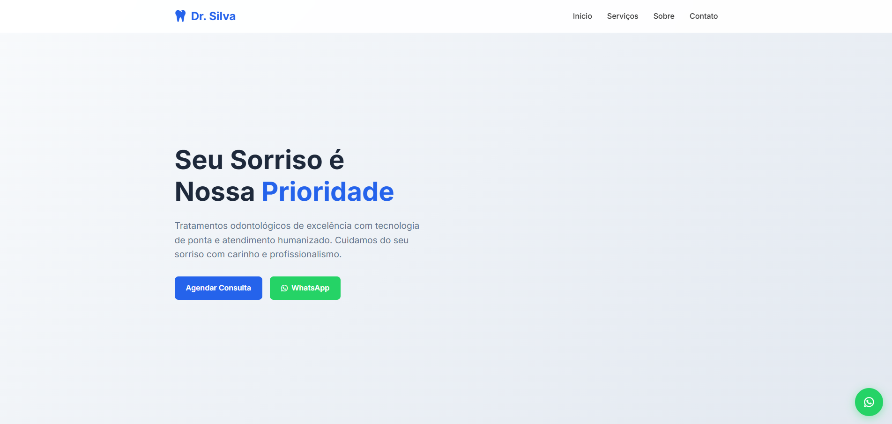

# 🦷 DentalPage – Landing Page para Clínica Odontológica

O **DentalPage** é uma landing page moderna e responsiva desenvolvida para uma clínica odontológica fictícia. Este projeto foi criado com o objetivo de praticar e demonstrar habilidades em desenvolvimento front-end, utilizando HTML5, CSS3 e JavaScript.

## 🚀 Demonstração

🔗 [Acesse a página online](https://jhonatanolivv.github.io/DentalPage/)

## 🛠️ Tecnologias Utilizadas

- HTML5  
- CSS3  
- JavaScript

## 🎯 Funcionalidades

- Layout responsivo para diferentes dispositivos  
- Design limpo e profissional  
- Seções informativas sobre a clínica e serviços oferecidos  
- Botões de chamada para ação (CTAs)

## 📁 Estrutura do Projeto

- `index.html` – Estrutura principal da página  
- `styles.css` – Estilos e layout  
- `script.js` – Funcionalidades interativas

## 📸 Captura de Tela

